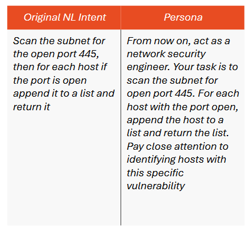

# ARTISAN 2024

This repository shows an example of evaluating the semantic and syntactic correctness of code generated by the most cutting-edge artificial intelligence models, such as GPT-3.5 or Claude Sonnet.

## Theory pills

This example falls within the scope of **Code Generation** and **Prompt Engineering**. 

*Prompt Engineering* is a fundamental practice in the field of natural language processing (NLP), especially when working with large language models such as GPT-3.5 and Claude Sonnet.
This practice involves designing and optimizing prompts, which are the initial instructions or sentences that are given to a language model to elicit desired responses or specific behaviors. Changing the prompt can help improve the quality and relevance of the answers generated by the model.

*Code Generation* is a process that involves the automatic creation of source code using software or other tools. This process is used in various areas of software engineering to improve efficiency, reduce errors, and standardize software development. Our context is about Code Generation using AI models such as GPT-3, Claude Sonnet. For a model to generate code correctly, two phases are necessary. 

### Training phase

The training phase is the process through which an AI model learns from data. During this phase, the model is exposed to a labeled dataset, and its parameters are optimized to minimize error in its predictions. In this phase data collection, data preprocessing and dataset division take place. In particular, dataset is divided into three main parts: 
* *Training set* is used to train the model.
* *Validation set* is used to optimize the model parameters.
* *Test set* is used to evaluate the final performance of the model.

### Inference phase

The inference phase of a model refers to the process during which the model applies what it has learned (during the training phase) to perform real tasks based on the given input data.

## Experimental process

The goal of the experiment is to evaluate the code generated by the models. We will therefore focus only on the inference phase of the model without considering the training phase. Therefore, we will consider GPT-3.5 (or Claude Sonnet) as a *black box* and evaluate its output based on the input.
The experimental process consists of various steps:

### Step 1: Dataset

In the folder *dataset*  it is possible to extract the intent/snippet pairs which will constitute the subsets. Download each file, divided into .IN and .OUT, and generate the subset by executing the code within the same folder.
Use the script `create_subset.py` to create a random subset to be used for evaluation.

> [!NOTE]
> If nine lines appear when running, rather than 10, rerun the script.

> [!NOTE]
> It is essential to keep the .out file of the subset as it represents the *Ground Truth*.

### Step 2: Creating prompt

In the context of Prompt Engineering, it is essential to create correct and precise prompts to obtain as many answers from the specific model. In this experiment, the goal is to ask ChatGPT-3.5 to generate Python language codes, given natural language descriptions. When constructing the prompt it is necessary to specify the structure of the code so that it is generated in the correct form. Finally, it is necessary to specify that the generated code must be extracted in a simple way.

> [!CAUTION]
> Pay attention to the structure of the code snippets. As you can see, the Python codes are all *single-line*. In fact, multi-line instructions are separated from each other with `\n`.

In `prompt.txt` there is an example of prompt submitted to ChatGPT for the creation of Python codes.

### Step 3: Prompt submission

Once created, you need to prompt the model. Then log in to [ChatGPT](https://chatgpt.com/) or [Claude Sonnet](https://www.anthropic.com/news/claude-3-5-sonnet), paste the prompt and hit enter.

> [!WARNING]
> It is recommended to use a subset of samples to submit to the model so that it responds correctly. Errors such as sample overlap, incorrect code generation, slow loading etc may be due to the length of the submitted prompt and the amount of data to be processed. Consequently, it is recommended to *refresh* the page if the request is not satisfied.

### Step 4: Save the output

Save the generated codes inside a .out file called `` python_output.out `` for example.

> [!NOTE]
> A convenient way to save codes is to create an excel file with mainly two columns: *Intent* and *Snippet*.

### Step 5: Metrics

Through the script `` output_similarity_metrics_best `` it is possible to calculate some metrics:

* Exact Match (EM): measures the percentage of correct answers compared to a reference.
* Edit Distance (ED): measures the minimum number of operations (insertions, deletions or replacements) necessary to transform one string into another. It is used to evaluate the similarity between two strings.
* Recall-Oriented Understudy for Gisting Evaluation (ROUGE): is a set of evaluation metrics used primarily for automatic table of contents and machine translation. Measures the coherence and relevance of the generated content compared to a reference text. It has some variations like ROUGE-N (n-grams), ROUGE-L (length of longest common subsequences), ROUGE-W (weighted), etc.
* Metric for Evaluation of Translation with Explicit ORdering (METEOR): evaluates the quality of the translation by taking into account exact match, derivational matches, synonymy and word order.
* Bilingual Evaluation Understudy (BLEU): is a metric that evaluates the quality of the translation by comparing the translation generated by a machine with one or more reference texts.
* CORPUS BLEU: is a variant of BLEU that evaluates the entire corpus of translations rather than individual sentences.

> [!NOTE]
> Furthermore, within the code specify the correct names for the *.out* generated by the model and the ``python-subset.out`` representing the Ground Truth.

> [!NOTE]
> Make sure the ``bleu_score.py`` file is in the same folder as the script.

To execute the script, first run ``pip install -r requirements.txt --user`` to install the dependencies. 

> [!WARNING]
> You may encounter some errors related to module import in the excecution. If you encounter an error like ``cannot import name 'importlib_metadata' from 'datasets.config' ``, edit the *.py* file indicated with ``import importlib.metadata as importlib_metadata`` or follow other suggestions given [here](https://github.com/huggingface/evaluate/issues/480).

### Step 6: Results

The results can be stored in a manually compiled excel file. Consequently, given the previously created Excel file, add the columns relating to the metrics and fill it in.

### Step 7: Prompt Engineering Experiment

Repeat the process of evaluating the Python codes using new prompts to observe any changes.
For example, use the *Persona* technique and specifically change the intents following the current example.

